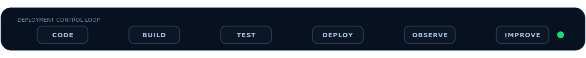

<p align="center">
  
</p>

<p align="center">
  <a href="https://github.com/theparsakhezli">
    
  </a>
  <a href="https://github.com/theparsakhezli?tab=followers">
    
  </a>
  <a href="mailto:parsakhezli8304@gmail.com">
    
  </a>
</p>

<p align="center">
  <a href="https://www.linkedin.com/in/ParsaKhezli">
    
  </a>
  <a href="mailto:parsakhezli8304@gmail.com">
    
  </a>
</p>



## `01 // ABOUT ME`

<p align="center">
  
</p>

I started in **Python/Django backend development** and gradually moved toward the systems that keep applications reliable after the code is shipped.

Today, I focus on **DevOps engineering**: Linux operations, containerized infrastructure, CI/CD, observability, self-hosted services, backups, migrations, and automation.

> **My default approach:** automate repeated work, make failures visible, keep rollback paths clear, and choose simple systems before unnecessary complexity.

## `02 // TOOLKIT`

<p align="center">
  
</p>

<p align="center">
  
  
  
  
  
</p>

<table>
  <tr>
    <td width="50%" valign="top">
      <h3>⚙️ Delivery &amp; Runtime</h3>
      <ul>
        <li>Linux and Ubuntu server operations</li>
        <li>Docker and Docker Compose deployments</li>
        <li>Nginx, reverse proxy, SSL, and domain routing</li>
        <li>GitLab CI/CD and GitHub Actions</li>
        <li>QA, staging, production, and rollback workflows</li>
      </ul>
    </td>
    <td width="50%" valign="top">
      <h3>📡 Visibility &amp; Automation</h3>
      <ul>
        <li>Prometheus, Grafana, exporters, and alerting</li>
        <li>ELK-based centralized logging</li>
        <li>Ansible playbooks and Bash automation</li>
        <li>Backup, migration, and recovery workflows</li>
        <li>Container and service health monitoring</li>
      </ul>
    </td>
  </tr>
  <tr>
    <td width="50%" valign="top">
      <h3>🧱 Application Foundation</h3>
      <ul>
        <li>Python and Django</li>
        <li>Django REST Framework</li>
        <li>PostgreSQL and Redis</li>
        <li>Backend production support</li>
        <li>API deployment and debugging</li>
      </ul>
    </td>
    <td width="50%" valign="top">
      <h3>🛰️ Current Expansion</h3>
      <ul>
        <li>Kubernetes fundamentals and deployment patterns</li>
        <li>GitOps workflows with Argo CD</li>
        <li>Advanced GitLab pipeline design</li>
        <li>Incident response and safer releases</li>
        <li>Infrastructure as Code principles</li>
      </ul>
    </td>
  </tr>
</table>


## `03 // WHAT I'M BUILDING`

<table>
  <tr>
    <td width="33%" valign="top">
      <h3>🖥️ DevOps Control Panel</h3>
      <p>An internal dashboard for service status, deployment versions, QA progress, container health, and daily operational tasks.</p>
    </td>
    <td width="33%" valign="top">
      <h3>🔁 Pipeline Templates</h3>
      <p>Reusable GitLab CI/CD patterns for backend, frontend, Docker deployments, staging environments, and controlled production releases.</p>
    </td>
    <td width="33%" valign="top">
      <h3>📊 Observability Stack</h3>
      <p>A production-style monitoring and logging setup using Prometheus, Grafana, exporters, alerting rules, and centralized logs.</p>
    </td>
  </tr>
  <tr>
    <td width="33%" valign="top">
      <h3>📦 Application Stack</h3>
      <p>Docker Compose environments for Django, PostgreSQL, Redis, Nginx, frontend services, monitoring, and persistent storage.</p>
    </td>
    <td width="33%" valign="top">
      <h3>🔐 Reliability</h3>
      <p>Server hardening, SSL, access control, backup verification, migrations, rollback planning, and failure isolation.</p>
    </td>
    <td width="33%" valign="top">
      <h3>☸️ Kubernetes Lab</h3>
      <p>A lightweight local lab for learning cluster operations, workloads, services, ingress, GitOps, and production deployment patterns.</p>
    </td>
  </tr>
</table>

## `04 // ENGINEERING PRINCIPLES`

```text
AUTOMATION     > repetition
OBSERVABILITY  > guessing
ROLLBACK       > hoping
DOCUMENTATION  > tribal knowledge
SIMPLICITY     > unnecessary complexity
RELIABILITY    > unsafe speed
```

## `05 // GITHUB ACTIVITY`

<p align="center">
  
  
</p>

<p align="center">
  
</p>

<p align="center">
  
</p>

## `06 // COLLABORATION CHANNEL`

I am interested in collaborating on:

- Self-hosted infrastructure and internal developer platforms
- CI/CD templates and deployment automation
- Monitoring, logging, and reliability projects
- Dockerized Python/Django systems
- Kubernetes and GitOps learning projects

<p align="center">
  <a href="https://www.linkedin.com/in/ParsaKhezli">
    
  </a>
  <a href="mailto:parsakhezli8304@gmail.com">
    
  </a>
  <a href="https://github.com/theparsakhezli?tab=repositories">
    
  </a>
</p>

<p align="center">
  <samp>
    SYSTEM STATUS: <b>BUILDING</b> · <b>LEARNING</b> · <b>SHIPPING</b>
  </samp>
</p>
